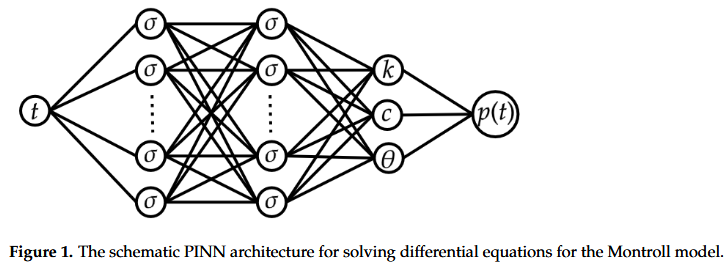
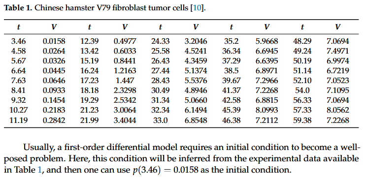

Here is a **clean, professional rewritten README** for your repository while keeping the same meaning but improving clarity, structure, and academic tone.

---

# Physics-Informed Neural Networks (PINNs) for Tumor Cell Growth Modeling

This repository presents an implementation of the methodology proposed in the research paper **“Using Physics-Informed Neural Networks (PINNs) for Tumor Cell Growth Modeling”** by **José Alberto Rodrigues**. The project applies **Physics-Informed Neural Networks (PINNs)** to estimate biological parameters and model tumor cell growth dynamics using experimental data obtained from Chinese hamster **V79 fibroblast tumor cells**.

---

# 📌 Project Overview

The main objective of this project is to demonstrate how **Physics-Informed Neural Networks (PINNs)** can be used to model biological systems governed by differential equations.

Unlike conventional neural networks that rely purely on data, **PINNs integrate physical or biological laws directly into the training process**. This is achieved by embedding the governing differential equations into the loss function of the neural network. As a result, the model can produce biologically consistent predictions even when experimental data is limited or noisy.

This repository focuses on predicting the **growth dynamics of multicellular tumor spheroids** using experimental measurements.

---

# 🧬 Mathematical Model

Tumor growth is modeled using the **Montroll Growth Model**, which describes population dynamics using a nonlinear differential equation:

\frac{dp}{dt}(t)=k p(t)\left(1-\left(\frac{p(t)}{C}\right)^{\theta}\right)

Where:

* **k** – Intrinsic tumor growth rate
* **C** – Carrying capacity (maximum tumor population)
* **θ** – Shape parameter controlling the location of the inflection point of the growth curve
* **p(t)** – Tumor cell population at time **t**

This model captures both the **initial exponential growth phase** and the **eventual saturation of tumor size**.

---

# 🧠 PINN Architecture

The neural network used in this implementation follows a **feedforward fully connected architecture**.

### Network Structure

* **Input Layer**
  Time variable **t**

* **Hidden Layers**
  Multiple dense layers with nonlinear activation functions such as:

  * `tanh`
  * `ReLU`

* **Output Layer**
  Predicted tumor population **p(t)**

The network learns the tumor growth dynamics by simultaneously fitting experimental data and satisfying the governing differential equation.

---

# ⚙️ Loss Function and Optimization

Training the PINN involves minimizing a **composite loss function** that combines data fitting with physics constraints.

[
\mathcal{L}*{PINN} =
\mathcal{L}*{data} +
\lambda \mathcal{L}_{physics}
]

Where:

**Data Loss**

[
\mathcal{L}_{data}
]

Measures the **mean squared error (MSE)** between the predicted tumor size and the experimental observations.

**Physics Loss**

[
\mathcal{L}_{physics}
]

Ensures that the neural network solution satisfies the Montroll growth differential equation.

**λ (Lambda)**

A regularization coefficient that balances the influence of the data and physics constraints during training.

Optimization is performed using the **ADAM optimizer**.

---

# 📊 Dataset

The dataset consists of **experimental measurements of tumor cell populations over time** obtained from studies involving **Chinese hamster V79 fibroblast tumor spheroids**.

These measurements are used to train the PINN to estimate the unknown biological parameters of the Montroll model.

---

# 📈 Results and Key Findings

The results reported in the original research indicate that:

* The PINN framework successfully captures the **saturation behavior of tumor growth**.
* The **Montroll growth model provides a superior fit** to experimental data compared to simpler growth models.
* The flexibility of parameter **θ** allows the model to better represent the **inflection point of the growth curve**.

Estimated parameters obtained from the model are approximately:

* **k ≈ 0.831** — intrinsic growth rate
* **C ≈ 7.333** — carrying capacity
* **θ ≈ 0.169** — inflection point parameter

These values demonstrate the ability of PINNs to **solve inverse biological modeling problems**.

---

# 🛠️ Implementation

The implementation can be executed in any Python environment that supports modern deep learning libraries.

Typical requirements include:

* Python 3.x
* TensorFlow or PyTorch
* NumPy
* Matplotlib

Training is performed using gradient-based optimization methods such as **ADAM**.

---

# 🔬 Applications

The methodology demonstrated in this repository can be applied to a wide range of **scientific and biomedical modeling problems**, including:

* Tumor growth prediction
* Epidemiological modeling
* Biological population dynamics
* Drug response modeling
* Systems biology

PINNs are particularly useful when **data is limited but governing physical laws are known**.

---

# 📜 Citation

The original research paper:

Rodrigues, J. A.
**Using Physics-Informed Neural Networks (PINNs) for Tumor Cell Growth Modeling.**
*Mathematics*, 2024, 12, 1195.
